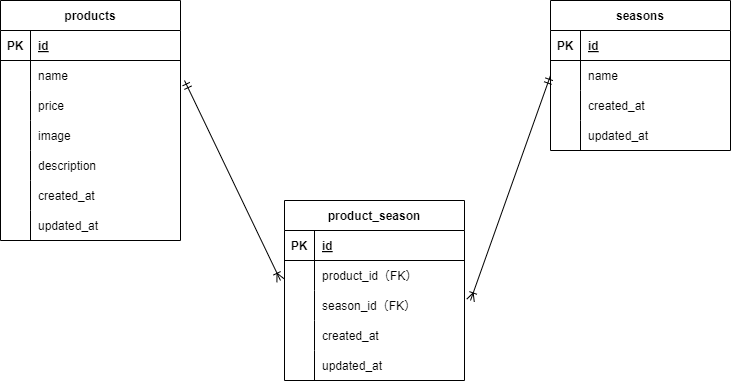

## アプリケーション名
確認テスト：もぎたて(商品管理システム)

---

## ER図

---

## プロジェクト概要
本プロジェクトは、Laravelを使用して商品管理機能を実装したWebアプリケーションです。  
以下の機能を提供します。  

---

## 主な機能
- **商品一覧表示**
  - ページネーション対応（6件ごと）  
  - 商品名による検索機能  
  - 価格の高い順・低い順での並び替え  
- **商品登録**
  - 商品名、値段、季節、商品画像、商品説明を登録  
  - バリデーション対応  
  - 画像アップロード機能  
- **商品詳細表示・編集**
  - 商品情報の表示と更新  
- **商品削除**
  - 削除機能（ごみ箱ボタン）  

---

## 必要な環境
- **PHP**: バージョン 7.3 以上
- **Laravel**: バージョン 8.75
- **Composer**: バージョン 2.0 以上
- **MySQL**: バージョン 8.0 以上
- **Docker**: バージョン 27.2.0 以上
- **Docker Compose**: バージョン 2.0 以上

---

## URL
- アプリケーション: `http://localhost` （Nginx経由）
- phpMyAdmin: `http://localhost:8080`

---

## デフォルトのデータベース設定
`docker-compose.yml` で設定されているデータベースの初期情報は以下の通りです。  
デフォルトのパスワードをそのまま本番環境で使用しないでください。

- データベース名: `laravel_db`
- ユーザー名: `laravel_user`
- パスワード: `laravel_pass`
- MySQLのルートパスワード: `root`

---

## セットアップ方法
1.リポジトリをクローンする
   リポジトリを GitHub からローカルにコピーします。  

     git clone https://github.com/shimodum/ability-test2.git  

   **クローン後、プロジェクトディレクトリに移動します**:  

      cd ability-test2
   
2.Docker コンテナを起動する  
   Docker Compose を使用して必要なサービスを立ち上げます。  
      初回起動や Dockerfile に変更があった場合には、以下のコマンドを実行してコンテナをビルドし直します。

    docker-compose up -d --build
   
3.依存関係をインストールする  
 　 PHP コンテナ内で Composer を使ってライブラリをインストールします。

    docker-compose exec php composer install
 
4.環境変数を設定する  
　 環境設定ファイル .env.example を .env にコピーし、アプリケーションの秘密鍵を生成します。

     cp .env.example .env  
     php artisan key:generate

5.ストレージへのシンボリックリンクを作成する  
  アップロード画像が適切に表示されるよう、ストレージと公開フォルダをリンクします。
   
    docker-compose exec php php artisan storage:link
   
6.データベースをマイグレートする  
   アプリケーションで使用するデータベースのテーブルを作成します。
   
    docker-compose exec php php artisan migrate
   
7.データをシーディングする  
　必要な初期データをデータベースに投入します。

    docker-compose exec php php artisan db:seed
   

